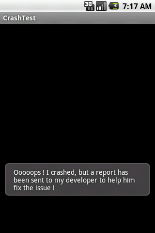
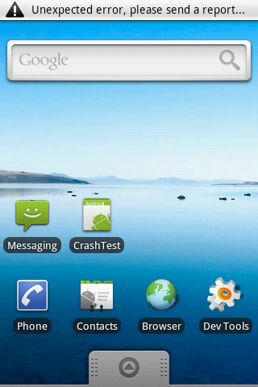
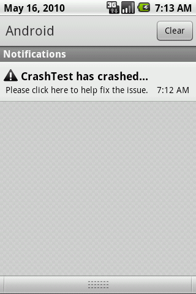
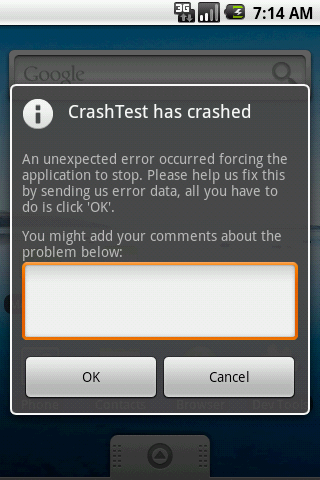

## Introduction

This is ACRA's Advanced Usage Guide. You need to [set up your project](BasicSetup) before using all the features
described here.

If you have any question or comment regarding ACRA, post a message on the [Discussion Group](http://groups.google.com/group/acra-discuss).

## Contents

- [Introduction](AdvancedUsage#introduction)
- [Contents](AdvancedUsage#contents)
- [User Interaction](AdvancedUsage#user-interaction)
	- [Toast notification](AdvancedUsage#toast-notification)
	- [Dialog](AdvancedUsage#dialog)
	- [Status bar notification](AdvancedUsage#status-bar-notification)
- [Report Destinations](Report-Destinations)
	- [Sending reports to your own self-hosted script](Report-Destinations#sending-reports-to-your-own-self-hosted-script)
		- [POST/PUT request](Report-Destinations#postput-request)
		- [Data encoding (FORM/JSON)](Report-Destinations#data-encoding-formjson)
	- [Adjusting the socket timeout](Report-Destinations#adjusting-the-socket-timeout)
	- [Sending reports by email](Report-Destinations#sending-reports-by-email)
	- [Implementing your own sender](Report-Destinations#implementing-your-own-sender)
- [Customizing the Content of the Reports](AdvancedUsage#customizing-the-content-of-the-reports)
	- [Adding your own custom variables or traces in crash reports ("Breadcrumbs")](AdvancedUsage#adding-your-own-custom-variables-or-traces-in-crash-reports-breadcrumbs)
	- [Adding logcat, eventlog or radiolog extracts to reports](AdvancedUsage#adding-logcat-eventlog-or-radiolog-extracts-to-reports)
	- [Adding your own log file extracts to reports](AdvancedUsage#adding-your-own-log-file-extracts-to-reports)
	- [Adding DropBoxManager events to your reports](AdvancedUsage#adding-dropboxmanager-events-to-your-reports)
	- [Adding the Device Unique ID to your reports](AdvancedUsage#adding-the-device-unique-id-to-your-reports)
	- [Choosing which fields to be included in reports](AdvancedUsage#choosing-which-fields-to-be-included-in-reports)
	- [Adding custom SharedPreferences names](AdvancedUsage#adding-custom-sharedpreferences-names)
	- [Exclude SharedPreferences keys](AdvancedUsage#exclude-sharedpreferences-keys)
	- [Exclude Settings keys](AdvancedUsage#exclude-settings-keys)
- [Letting your users control ACRA](AdvancedUsage#letting-your-users-control-acra)
	- [Enable/disable ACRA](AdvancedUsage#enabledisable-acra)
	- [Enable/disable system logs](AdvancedUsage#enabledisable-system-logs)
	- [Enable/disable including DeviceID](AdvancedUsage#enabledisable-including-deviceid)
	- [Set an email address to be added to reports](AdvancedUsage#set-an-email-address-to-be-added-to-reports)
	- [Enable/disable auto accept reports](AdvancedUsage#enabledisable-auto-accept-reports)
- [Sending reports for caught exceptions or for unexpected application state without any exception](AdvancedUsage#sending-reports-for-caught-exceptions-or-for-unexpected-application-state-without-any-exception)
- [Dynamic Configuration](AdvancedUsage#dynamic-configuration)
	- [Configuring a KeyStore](AdvancedUsage#configuring-a-keystore)
- [Catching Application Not Responding Errors (ANR)](AdvancedUsage#catching-application-not-responding-errors-anr)
- [Catching Native Code Errors](AdvancedUsage#catching-native-code-errors)
- [Deprecated code at new versions](AdvancedUsage#deprecated)
- [ACRA with instant run](AdvancedUsage#instant-run)

## User Interaction

The default behavior of ACRA is to send crash reports silently. From the application user point of view, the app closes, and that's all. Though, a report has been sent without the user being
aware of it.

Depending on the state of your application and your concern of your users data plan usage and private data handling,
you might prefer notifying them that a crash report has been sent, or even ask them the authorization to send one...
and why not ask them to describe what they were doing during the crash.

ACRA offers all these options, and allows you to customize your application crash reporting notifications.

In addition to a silent mode, 3 notification modes are available:

* display a simple Toast with the text of your choice:



* display a status bar notification, then offering the user a dialog asking him to send the report or not, with an
optional comment field:





* **since 4.3.0b1** - display the same dialog on application restart, without requiring a notification

Enabling user notification only requires you to add parameters to the `@ReportsCrashes` annotation and some string
values to your resources.

### Toast notification

```java
@ReportsCrashes(formUri = "http://yourserver.com/yourscript",
                mode = ReportingInteractionMode.TOAST,
                resToastText = R.string.crash_toast_text)
public class MyApplication extends Application {
...
```

In your `strings.xml` :
```xml
<string name="crash_toast_text">Ooooops ! I crashed, but a report has been sent to my developer to help fix the issue !</string>
```

### Dialog
**Since 4.3.0b1**

The `DIALOG` mode was introduced in ACRA 4.3, aimed at replacing the `NOTIFICATION` mode as
it is more user friendly. 

```java
@ReportsCrashes(formUri = "http://yourserver.com/yourscript",
                mode = ReportingInteractionMode.DIALOG,
                resToastText = R.string.crash_toast_text, // optional, displayed as soon as the crash occurs, before collecting data which can take a few seconds
                resDialogText = R.string.crash_dialog_text,
                resDialogIcon = android.R.drawable.ic_dialog_info, //optional. default is a warning sign
                resDialogTitle = R.string.crash_dialog_title, // optional. default is your application name
                resDialogCommentPrompt = R.string.crash_dialog_comment_prompt, // optional. When defined, adds a user text field input with this text resource as a label
                resDialogEmailPrompt = R.string.crash_user_email_label, // optional. When defined, adds a user email text entry with this text resource as label. The email address will be populated from SharedPreferences and will be provided as an ACRA field if configured.
                resDialogOkToast = R.string.crash_dialog_ok_toast // optional. displays a Toast message when the user accepts to send a report.
                resDialogTheme = R.style.AppTheme_Dialog, //optional. default is Theme.Dialog
                )
public class MyApplication extends Application {
...
```

In your `strings.xml`:

```xml
<string name="crash_toast_text">Ooooops ! I crashed, but a report has been sent to my developer to help fix the issue !</string>
    
<string name="crash_dialog_title">CrashTest has crashed</string>
<string name="crash_dialog_text">An unexpected error occurred forcing the
    application to stop. Please help us fix this by sending us error data,
    all you have to do is click OK.</string>
<string name="crash_dialog_comment_prompt">You might add your comments about the problem below:</string>
<string name="crash_dialog_ok_toast">Thank you !</string>
```

In your res/values/styles.xml:
```xml
<?xml version="1.0" encoding="utf-8"?>
<resources>
    ....
  <style name="AppTheme.Dialog" parent="Theme.AppCompat" /> //example, for use with support-v7
</resources>
```
### Custom dialog
You can also make custom dialog for error notification. To create it, copy org.acra.dialog.CrashReportDialog to your custom class like CustomCrashReportDialog, change what you need and call it like 
`reportDialogClass = CustomCrashReportDialog.class`
in your @ReportsCrashes settings. You will also have to reference this new activity in your manifest:
```xml

        <activity
            android:name=".CustomCrashReportDialog"
            android:excludeFromRecents="true"
            android:finishOnTaskLaunch="true"
            android:launchMode="singleInstance"
            android:theme="@android:style/Theme.Dialog" />
```
### Status bar notification
This is a legacy feature, as Dialog mode is generally preferred. However, if you really want to use it, *in addition to the changes in the DIALOG section*, add the following values.

```java
@ReportsCrashes(// Enter values from DIALOG section of wiki here!
                resNotifTickerText = R.string.crash_notif_ticker_text,
                resNotifTitle = R.string.crash_notif_title,
                resNotifText = R.string.crash_notif_text,
                resNotifIcon = android.R.drawable.stat_notify_error // optional. default is a warning sign
                )
public class MyApplication extends Application {
...
```

In your `strings.xml`:

```xml
<!--Strings from Dialog section of wiki go here!-->
<string name="crash_notif_ticker_text">Unexpected error, please send a report...</string>
<string name="crash_notif_title">CrashTest has crashed...</string>
<string name="crash_notif_text">Please click here to help fix the issue.</string>
```


## Customizing the Content of the Reports

ACRA provides [lots of data about the device and the state of your application](ReportContent). There are some options
to let you add even more data to help debugging.

### Adding your own custom variables or traces in crash reports ("Breadcrumbs")

To help you track some specific issue, you can add custom data to reports.

Simply use the following method when certain events happen in your code :

```java
ACRA.getErrorReporter().putCustomData("myKey", "myValue");
```

All your custom data (key/value pairs) will be added in the report column `CUSTOM` just before the crash (stack trace). Each key/value pair will be shown on one line. Note that each key is a `set` that can only be used once, without duplicates. So if you re-use the same `key` for a different `value`, then the old `value` will be deleted and replaced with the new `value`.

If you want the report to show "Breadcrumbs" to indicate which events happened in time order, just before a crash, then you need to track events using unique keys. Here's an example:

```java
public static void trackBreadcrumb(String event) {
    ACRA.getErrorReporter().putCustomData("Event at " + System.currentTimeMillis(), event);
}

protected void onCreate(Bundle savedInstanceState) {
    super.onCreate();
    trackBreadcrumb("MyActivity.onCreate()");
    ...
}
```


You can also use `getCustomData("myVariable")` and `removeCustomData("myVariable")` to get/remove data from the custom
data map.

### Adding logcat, eventlog or radiolog extracts to reports

You can enable adding a [logcat](http://developer.android.com/intl/fr/guide/developing/tools/adb.html#logcat) extract to
your reports by simply adding the `READ_LOGS` permission:

```xml
<manifest ...>
    ...
    <uses-permission android:name="android.permission.READ_LOGS"></uses-permission>
</manifest>
```

The default behavior is to include the result of the following command:

```shell
    adb logcat -t 200 -v time
```

This results to 200 lines of logcat with date, invocation time, priority/tag, and PID of the originating process.

If this is not what you want, you can change this with your own command line using the `logcatArguments` in the
`@ReportsCrashes` annotation. For example, if you prefer using:

```shell
    adb logcat -t 100 -v long ActivityManager:I MyApp:D *:S
```
then add this to you {@ReportsCrashes} config:

```java
    logcatArguments = { "-t", "100", "-v", "long", "ActivityManager:I", "MyApp:D", "*:S" }
```

As you can see, you just have to split your command line arguments to a String array on each white space.

Note: you can find further information about how to use logcat [here](http://developer.android.com/tools/debugging/debugging-log.html), logcat (used in the backend by ACRA) will be able to filter by tag, that you will need to keep constant in your application.

Note for experts: even if the `-t XXX` argument is only available since android 2.2, you can use it safely as ACRA
emulates it for older devices.

In addition to the `main` default buffer, ACRA can retrieve the 2 other alternative buffers `event` and `radio`. If
these data are of any use for you, you have to activate their collection:
* add `EVENTSLOG` and `RADIOLOG` fields to the CrashReports-Template.csv file before creating your spreadsheet
* copy the content of your new csv template and paste it in the `@ReportsCrashes.customReportContent` parameter.

> **Note:** *System logs may contain private data logged by other applications like user email address, calendar events,
> contacts data...
> You should consider [#Enable/disable_system_logs adding a user preference item to let your user choose to include
> system logs or not].*

> **Warning:** *collecting long system logs might take quite some time and
> induce a latency right after your application crash. Include them only
> if you know how to analyze them and avoid collecting more than 100 lines.*

> **Final note:** *`READ_LOG` permission is not granted to third-party apps anymore since Android 4.1 (JellyBean).
> Starting with this version, logcat provides only traces from your own app, without requiring a permission. JellyBean
> logcat logs are retrieved by ACRA starting with version 4.3.0b2*

### Adding your own log file extracts to reports
**Since 4.3.0b1**

If you chose to log your debug traces to an independent file (using for example
[android-logging-log4j](http://code.google.com/p/android-logging-log4j), [slf4j](http://www.slf4j.org/android/) or
[logback-android](http://tony19.github.com/logback-android/)), ACRA can get the latest lines from this file and send
them in your reports.

Include the field `APPLICATION_LOG` in your `customReportContent` and spreadsheet template then configure it with:

* `@ReportsCrashes(applicationLogFile = "applog.log")` to define the path/name of the log file
* `@ReportsCrashes(applicationLogFileLines = 150)` to set the number of latest lines you want to be retrieved (default
  is 100).

### Adding DropBoxManager events to your reports

[DropBoxManager](http://developer.android.com/intl/fr/reference/android/os/DropBoxManager.html) has been introduced in
android API level 8 (2.2 - FroYo). This is a new logging system focused on persisting long chunks of text or data for
debugging purposes. There is a
[Q&A on StackOverflow](http://stackoverflow.com/questions/4434192/dropboxmanager-use-cases) explaining the usage of this
system.

As it is a rarely used feature, you need to enable it by including the field `DROPBOX` in your `customReportContent`.

You need the READ_LOGS permission to collect these data, add it to your manifest with:

```xml
<manifest ...>
    ...
    <uses-permission android:name="android.permission.READ_LOGS"></uses-permission>
</manifest>
```

> **Note:** *`READ_LOG` permission is not granted to third-party apps anymore since Android 4.1 (JellyBean). Starting
> with this version, logcat provides only traces from your own app, without requiring a permission. JellyBean logcat
> logs are retrieved by ACRA starting with version 4.3.0b2*

A list of DropBox tags has been built by searching for `DropBoxManager` usage in android source code. All these system
tagged events can be retrieved if you set `@ReportsCrashes.includeDropBoxSystemTags` to `true` on your `Application`
class:
* `system_app_anr`
* `system_app_wtf`
* `system_app_crash`
* `system_server_anr`
* `system_server_wtf`
* `system_server_crash`
* `BATTERY_DISCHARGE_INFO`
* `SYSTEM_RECOVERY_LOG`
* `SYSTEM_BOOT`
* `SYSTEM_LAST_KMSG`
* `APANIC_CONSOLE`
* `APANIC_THREADS`
* `SYSTEM_RESTART`
* `SYSTEM_TOMBSTONE`
* `data_app_strictmode`
  
You can add your own dropbox tags using `@ReportsCrashes.additionalDropBoxTags()`, and set the max age in minutes for
events to be retrieved using `@ReportsCrashes.dropboxCollectionMinutes()`.

```java
@ReportsCrashes { formUri = "http://yourserver.com/yourscript",
    ...
    inlcudeDropBoxSystemTags = true, // default is false
    additionalDropBoxTags = {"your_own_tag", "another_additional_tag"},
    dropboxCollectionMinutes = 10 // default is 5
    ...
```

> **Warning:** *collecting DropBox events might take quite some time and
  induce a latency right after your application crash.
  Increase the `dropBoxCollectionMinutes` only if you know what you are doing.*

### Adding the Device Unique ID to your reports

In some circumstances, tracking exactly which identified devices throw which report can be necessary. ACRA will include
your users Device ID (IMEI for GSM and the MEID or ESN for CDMA phones) if you add the following permission to your
application manifest:

```xml
<manifest ...>
    ...
    <uses-permission android:name="android.permission.READ_PHONE_STATE"></uses-permission>
</manifest>
```

> **Note:** *This unique device ID is considered as private data as it could let you track users behaviors...
  You should consider [adding a user preference item to let your user choose to include this device id or not](AdvancedUsage#Enable/disable_including_DeviceID).*

### Choosing which fields to be included in reports

You can change the default set of fields included in your reports using
`@ReportsCrashes(customReportContent = { array of ReportField })`. For example:

```java
import static ReportField.*;

@ReportsCrashes(formUri = "http://yourserver.com/yourscript",
                customReportContent = { APP_VERSION, ANDROID_VERSION, PHONE_MODEL, CUSTOM_DATA, STACK_TRACE, LOGCAT },                
                mode = ReportingInteractionMode.TOAST,
                resToastText = R.string.crash_toast_text)
public class MyApplication extends Application {
...
```

If using GoogleDoc Forms as a backend, your spreadsheet has to be created with the same columns. One easy way to
recreate it is to copy/paste the list of fields (without the array braces) in a new text file with .csv extension and
import it in GoogleDocs.

Limiting your reports to what you really want and really use can help avoiding performance issues when collecting
reports data. Only fields which are set in customReportContent are actually processed.


### Adding custom SharedPreferences names

The system [default SharedPreferences](http://developer.android.com/reference/android/preference/PreferenceManager.html#getDefaultSharedPreferences(android.content.Context)) for your application are automatically
collected in the `SHARED_PREFERENCES` field.

If your app contains multiple `SharedPreferences` files, or if you are using a non-default name, you can add them by providing their names with:

```java
@ReportsCrashes(additionalSharedPreferences={"my_own_prefs","a_second_prefs"})
```
> **Note:** *your shared preferences file name is set when you declare your SharedPreference class intances*
>
>```java
>context.getSharedPreferences("My file name to be used in acra", Context.MODE_PRIVATE);
>```

### Exclude SharedPreferences keys
**Since 4.3.0b1**

If your `SharedPreferences` contain private data that you don't want to be transmitted in reports, you can define
exclusion rules using [Regular Expressions](http://en.wikipedia.org/wiki/Regular_expression) provided in the
`excludeMatchingSharedPreferencesKeys` configuration item.

Every key matching any of these regular expressions will be excluded from reports. 

```java
@ReportsCrashes(excludeMatchingSharedPreferencesKeys={"^user.private","password"})
```

### Exclude Settings keys
**Since 4.5.0**

Similarly to SharedPreferences, you may want to exclude some keys from the various settings fields collected by ACRA.

The configuration item to use is `excludeMatchingSettingsKeys`.

## Letting your users control ACRA

Some ACRA behaviors can be configured by your application users through the use of `SharedPreferences` items:
* enable/disable ACRA
* enable/disable system logs
* enable/disable including DeviceID
* set an email address to be added to reports
* enable/disable auto accept reports

You can store any ACRA `SharedPreferences` separately from your application `SharedPreferences`. To do so use the following `@ReportsCrashes` parameters:
  * `sharedPreferencesName`: Name of the `SharedPreferences` that will host the various `acra.*` preferences.
  * `sharedPreferencesMode`: The mode that you need for the `SharedPreference` file creation: `Context.MODE_PRIVATE`,
    `Context.MODE_WORLD_READABLE` or `Context.MODE_WORLD_WRITEABLE`.

### Enable/disable ACRA

Add to your preferences xml file a CheckBoxPreference (checking it disables ACRA) :
```xml
<CheckBoxPreference android:key="acra.disable"
    android:title="@string/pref_disable_acra"
    android:summaryOn="@string/pref_acra_disabled"
    android:summaryOff="@string/pref_acra_enabled"
    android:defaultValue="false"/>
```

Or if you prefer the opposite (checking it to enable ACRA):
```xml
<CheckBoxPreference android:key="acra.enable"
    android:title="@string/pref_enable_acra"
    android:summaryOn="@string/pref_acra_enabled"
    android:summaryOff="@string/pref_acra_disabled"
    android:defaultValue="true"/>
```

Then add to your `strings.xml` files the 3 corresponding string resources.

### Enable/disable system logs

Including logcat extracts in reports is a great tool for developers, but it can lead to privacy issues as some other
applications might log private data like user account names, opened URLs, calendar events...

Giving your users a way to control the inclusion of logcat data make them understand that you care about their privacy.
This can be done with the inclusion of the following `CheckBoxPreference`:

```xml
 <CheckBoxPreference android:key="acra.syslog.enable"
    android:summaryOn="@string/pref_acra_syslog_enabled"
    android:summaryOff="@string/pref_acra_syslog_disabled"
    android:title="@string/pref_acra_syslog"
    android:defaultValue="true"/>
```

Of course you have to define the matching strings in your `strings.xml` files.

### Enable/disable including DeviceID

If you added the `READ_PHONE_STATE` permission to your application but
want to let your user be able to disable the inclusion of their Device ID in
crash reports, you can include the following `CheckBoxPreference`:

```
 <CheckBoxPreference android:key="acra.deviceid.enable"
    android:title="@string/pref_acra_deviceid"
    android:summaryOn="@string/pref_acra_deviceid_enabled"
    android:summaryOff="@string/pref_acra_deviceid_disabled" 
    android:defaultValue="true"/>
```

Don't forget to add the required strings in your `strings.xml` files.

### Set an email address to be added to reports

Some users might be willing to help debugging your app. You can ask them
to input an email address that will be included in every report to allow you
contact them:  

```xml
 <EditTextPreference android:key="acra.user.email"
    android:title="@string/pref_acra_user_email"
    android:summary="@string/pref_acra_user_email_summary"/>
```

### Enable/disable auto accept reports

While in `NOTIFICATION` or `DIALOG` mode, you can allow your users to choose to auto-accept sending all reports. This
is like letting them switch from `NOTIFICATION`/`DIALOG` mode to `TOAST` mode.

```xml
 <CheckBoxPreference android:key="acra.alwaysaccept"
    android:title="@string/pref_acra_alwaysaccept"
    android:summaryOn="@string/pref_acra_alwaysaccept_enabled"
    android:summaryOff="@string/pref_acra_alwaysaccept_disabled"
    android:defaultValue="false"/>
```

## Sending reports for caught exceptions or for unexpected application state without any exception

As a good programmer, your code is full of try/catch statements, and sometimes an interesting (unexpected) exception
might be caught in one of these.

You could also want your application to send a report without any Exception thrown, just because you know that your
application is in an unexpected state.

Both of these needs can be covered by this :

```java
ACRA.getErrorReporter().handleException(caughtException);
```

You can provide any caught or custom Exception, or even `null` if you don't have any to provide.

If you need to add silent trace reports whatever notification mode you configured for your application, you can also
use:

```java
ACRA.getErrorReporter().handleSilentException(caughtException);
```

## Dynamic Configuration
**Since 4.3.0b1**

Every `@ReportsCrashes` parameter can also be set on runtime. This was needed since ADT 17 where Android Library
Projects could not be used with ACRA due to their resources identifiers not being final fields anymore. Some advanced
developers also needed to adjust ACRA parameters depending on user choices or when enabling special debug modes.

**Until 4.9.0**
The method `ACRA.getConfig()` returns an `ACRAConfiguration` object which provides a setter for each `@ReportsCrashes`
configuration item.

You can even use `ACRA.getNewDefaultConfig(Application)` to create a new configuration object initialized with default
values + values set in your annotation parameters, modify some values, keep the object in memory for later use, and set
it to `ACRA.setConfig(ACRAConfiguration)` when needed.

**Current**
ACRA can be configured using a `ConfigurationBuilder` which then has to be passed to `ACRA.init`.

### Configuring a KeyStore

_For 4.7 and before_
```java
@ReportsCrashes{
    ...
}
public class MyApp {
    protected void attachBaseContext(Context base) {
        super.attachBaseContext(base);
        final KeyStore keyStore = ..
        final ACRAConfiguration config = ACRA.getNewDefaultConfig(this);
        config.setKeyStore(keyStore);
        ACRA.init(this, config);
    }
}
```
_For 4.8_
```java
@ReportsCrashes{
    ...
}
public class MyApp {
    protected void attachBaseContext(Context base) {
         super.attachBaseContext(base);
        final KeyStore keyStore = ..
        final ACRAConfiguration config = new ConfigurationBuilder()
            .setKeyStore(keyStore)
            .build();
        ACRA.init(this, config);
    }
}
```
_For 4.9_
```java
@ReportsCrashes{
    keyStoreFactoryClass=MyKeyStoreFactory.class
    ...
}
public class MyApp {
        ...
}
```
```java
public class MyKeyStoreFactory extends BaseKeyStoreFactory {// or KeyStoreFactory for more control
    ...
}
```
Alternatively you can use the `certificatePath`, `resCertificate` and `certificateType` configuration options to use one of ACRAs default KeyStoreFactories.

## Catching Application Not Responding errors (ANR)

ACRA has no integrated system to monitor your app and send reports when it's not responding.

There is an interesting approach provided by [Salomon Brys on Github](https://github.com/SalomonBrys/ANR-WatchDog). Its watchdog thread tries to execute a small code every 5 seconds and throws an exception if it failed. This exception will be reported by ACRA.

## Catching Native Code errors

ACRA does not catch errors occurring in native code.
We currently don't know any stable solution to catch native errors with ACRA.

## Deprecated

**Since 4.6**

ACRA removed `formKey`, this option needs to be removed after version 4.6 at your `@ReportsCrashes` settings.

## Instant run

You can't use instant run with ACRA because ACRA runs in a separate process and instant run does not support multiple processes. However there is some way you can use both. You have to disable ACRA for debugging.

Steps:

1. Use `releaseCompile`instead of `compile` for ACRA in your gradle build: `releaseCompile 'ch.acra:acra:X.X.X'`

You probably have some file called `MyApplication` where you initialize ACRA. This is the same class you use in your manifest in your application starttag. This file is in `app/src/main/some/path/to/MyApplication.java`

2. Copy this file and paste in `app/src/debug/some/path/to/MyApplication.java` and `app/src/release/some/path/to/MyApplication.java`
3. Delete `app/src/main/some/path/to/MyApplication.java`
4. In `app/src/debug/some/path/to/MyApplication.java` remove anything that has to do something with ACRA

Now you can use ACRA in you release builds and use instant run during debug.


